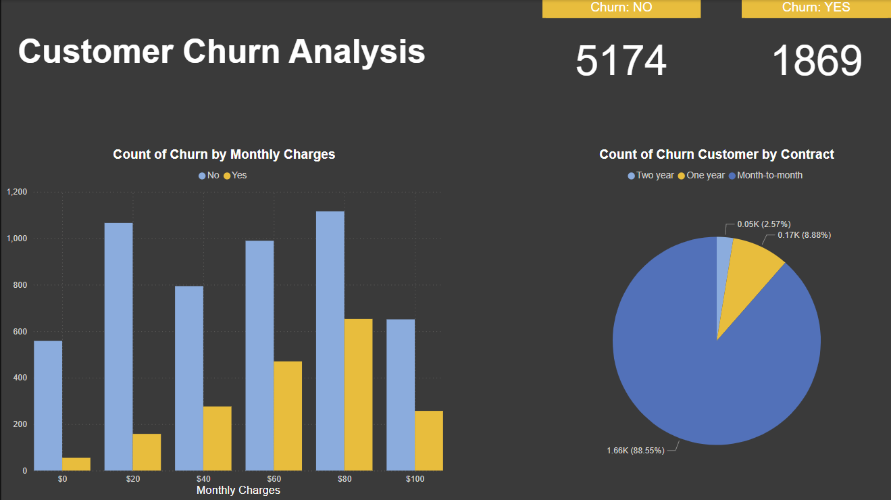

# 📊 Power BI Report – Customer Churn Dashboard

This Power BI dashboard is built to visualize key churn-related insights based on the Telco Customer Churn dataset. It complements the machine learning prediction app and provides a business-level overview of customer behavior.

---

## 🧠 Purpose

To help stakeholders understand:
- What patterns lead to customer churn
- How features like contract type, monthly charges, and tenure impact churn
- Where intervention strategies can be targeted

---

## 📈 Report Highlights

- Churn vs Non-Churn Summary
- Monthly Charges Distribution
- Customer Contract Type Breakdown
- Tenure and Churn Analysis
- KPI Cards for Total Customers, Churn Rate, and High-Risk Segments
- Interactive filters for Payment Method, Internet Service, Gender, etc.

---

## 📁 Files

- `customer-churn.pbix`: The full Power BI Desktop report
- `report-screenshot.png`: Preview of the main report dashboard
- `qr-code.jpg`: Scan to open the published Power BI App

---

## 🖼️ Dashboard Preview

  

---

## 📱 Scan to View Online

  

Or view directly:  
🔗 [Power BI App](https://app.powerbi.com/Redirect?action=OpenApp&appId=76c1d8d4-234b-497c-93e1-41eca07c048d&ctid=e8fe393e-b0c7-4e81-addc-84295f3382c5&experience=power-bi)

---

## 📂 Dataset

- Source: [Telco Customer Churn (Kaggle)](https://www.kaggle.com/datasets/blastchar/telco-customer-churn)
- Preprocessed with Python, exported to CSV
- Predictions integrated from trained ML model

---

## 🙌 Author

Created by **Mithun Marshal**  
Part of the [Customer Churn Prediction App](https://github.com/9mithun9/customer-churn-prediction-app)
